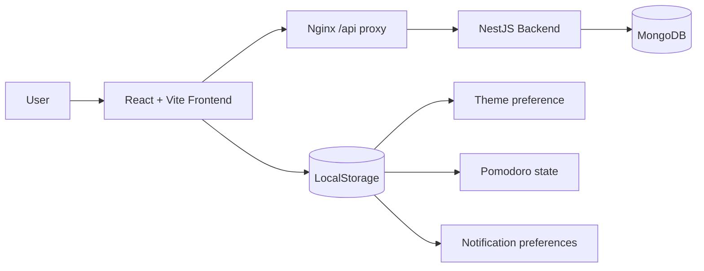
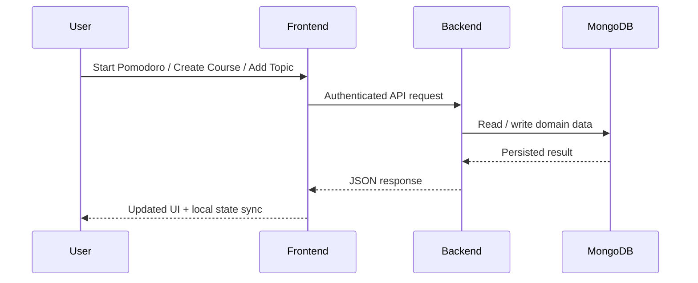

# MyTime


MyTime is a study tracking application focused on structured learning sessions, course organization, and Pomodoro-based time management.

The project is a monorepo with a React frontend, a NestJS backend, and MongoDB as the primary database.

## At a Glance

- study tracking with courses, topics, and session history
- Pomodoro workflow with browser notifications and completion sound
- secure auth with access token + rotating refresh cookie
- React SPA in front, NestJS API in back, MongoDB underneath
- Docker-ready local environment

## Quick Start

```bash
pnpm install
docker compose up -d --build
```

Then open:

- app: `http://localhost`
- API: `http://localhost:3000/api`

## Product Snapshot

MyTime is designed around a simple loop:

1. create a course
2. break it into topics
3. run focused Pomodoro sessions
4. persist sessions and progress
5. review statistics and keep momentum

## Architecture Preview



## Request Flow



## Overview

MyTime helps a user:

- register and authenticate securely
- create and organize courses
- add topics inside each course
- run Pomodoro sessions linked to a course or topic
- store study sessions and statistics
- archive and reactivate courses
- use light/dark theme preferences
- enable Pomodoro completion sound and browser notifications

## Tech Stack

### Frontend

- React 18
- Vite
- TypeScript
- Tailwind CSS
- shadcn/ui primitives built on Radix UI

### Backend

- NestJS
- TypeScript
- Mongoose
- MongoDB
- JWT auth with refresh token rotation

### Infra

- Docker
- Docker Compose
- Nginx for frontend static serving and API reverse proxy

## Monorepo Structure

```text
mytime/
|- backend/                 # NestJS API
|- frontend/                # React + Vite SPA
|- packages/                # Shared packages/contracts
|- docker-compose.yml       # Local Docker stack
|- package.json             # Root workspace scripts
|- pnpm-workspace.yaml
`- .env.example
```

## Main Features

### Authentication

- register and login
- JWT access token in memory
- refresh token stored in httpOnly cookie
- token refresh flow on authenticated API calls
- logout invalidates session

### Courses

- create, update, delete
- archive and reactivate
- course progress summary

### Topics

- create topics per course
- edit and delete topics
- topic ordering support in backend

### Pomodoro

- focus, short break, and long break modes
- state persistence in localStorage
- completion registration in backend
- optional sound when session ends
- optional browser notification when session ends

### Statistics

- total study time
- total sessions
- completion rate
- per-course breakdown
- recent daily activity

## UX Highlights

- archive and reactivate courses without losing their structure
- confirmation dialogs for destructive actions
- light and dark theme toggle
- browser notification and sound preferences for Pomodoro completion
- automatic API refresh flow for authenticated sessions

## Local Development

### Requirements

- Node.js 20+
- pnpm 9+
- Docker and Docker Compose

### 1. Install dependencies

```bash
pnpm install
```

### 2. Configure environment

The backend uses the variables described in `.env.example`.

For local development outside Docker, create:

```text
backend/.env
```

You can start from:

```bash
cp .env.example backend/.env
```

If you are on Windows PowerShell, create the file manually or use:

```powershell
Copy-Item .env.example backend/.env
```

### 3. Start MongoDB

```bash
docker compose up -d mongo
```

### 4. Run backend and frontend

```bash
pnpm dev
```

Or separately:

```bash
pnpm dev:backend
pnpm dev:frontend
```

### Local URLs

- frontend: `http://localhost:5173`
- backend: `http://localhost:3000`
- API base: `http://localhost:3000/api`

## Docker Setup

The project includes a complete Docker setup for frontend, backend, and MongoDB.

### Run the full stack

```bash
docker compose up -d --build
```

### Docker URLs

- app: `http://localhost`
- API: `http://localhost:3000/api`
- MongoDB: `mongodb://localhost:27017/mytime`

### Services

- `mongo` -> MongoDB 7
- `backend` -> NestJS API
- `frontend` -> Nginx serving React build and proxying `/api`

### Running the frontend container standalone

This project currently serves the frontend as a static Vite build behind Nginx.

That means the frontend does **not** behave like a runtime Node application that reads environment variables dynamically after the container starts.

Current behavior:

- the SPA is built ahead of time
- API calls use relative `/api` paths
- in Docker, Nginx proxies `/api` to the backend container

Important consequence:

- if you run the frontend container alone, the UI can load
- but authenticated features and API-driven screens will fail unless `/api` still points to a real backend

In other words, the frontend currently depends on one of these setups:

1. Docker Compose with the bundled backend service
2. a reverse proxy that forwards `/api` to a reachable backend
3. a future refactor that introduces a configurable external API base URL

At the moment, standalone frontend execution is **not fully decoupled** from backend routing.

If you want to run the frontend by itself in production-like environments, the recommended next step is to introduce a configurable API base strategy such as:

- build-time `VITE_API_BASE_URL`
- or runtime config injection via Nginx/template/config file

## Workspace Scripts

At root level:

```bash
pnpm dev
pnpm dev:frontend
pnpm dev:backend
pnpm test
pnpm lint
pnpm typecheck
```

### Package Scripts

#### Backend

```bash
pnpm --filter @mytime/backend dev
pnpm --filter @mytime/backend build
pnpm --filter @mytime/backend test
pnpm --filter @mytime/backend lint
pnpm --filter @mytime/backend typecheck
```

#### Frontend

```bash
pnpm --filter @mytime/frontend dev
pnpm --filter @mytime/frontend build
pnpm --filter @mytime/frontend preview
pnpm --filter @mytime/frontend test
pnpm --filter @mytime/frontend lint
pnpm --filter @mytime/frontend typecheck
```

## Environment Variables

Current example values:

```env
NODE_ENV=development
PORT=3000
MONGO_URI=mongodb://localhost:27017/mytime
JWT_ACCESS_SECRET=replace-with-long-access-secret
JWT_REFRESH_SECRET=replace-with-long-refresh-secret
JWT_ACCESS_TTL=15m
JWT_REFRESH_TTL=7d
COOKIE_NAME=mytime_refresh
COOKIE_DOMAIN=localhost
COOKIE_SECURE=false
CORS_ORIGIN=http://localhost:4200
FRONTEND_API_URL=http://localhost:3000/api
POMODORO_FOCUS_MINUTES=25
POMODORO_SHORT_BREAK_MINUTES=5
POMODORO_LONG_BREAK_MINUTES=15
```

### Notes about environment

- `CORS_ORIGIN` in Docker is overridden inside `docker-compose.yml`
- `COOKIE_SECURE=false` is correct for local HTTP development only
- JWT secrets must be replaced before any real deployment

## API Summary

### Auth

- `POST /api/auth/register`
- `POST /api/auth/login`
- `POST /api/auth/refresh`
- `POST /api/auth/logout`

### Courses

- `GET /api/courses`
- `POST /api/courses`
- `GET /api/courses/:id`
- `PATCH /api/courses/:id`
- `DELETE /api/courses/:id`

### Topics

- `GET /api/courses/:courseId/topics`
- `POST /api/courses/:courseId/topics`
- `PATCH /api/courses/:courseId/topics/reorder`
- `PATCH /api/topics/:id`
- `DELETE /api/topics/:id`

### Pomodoro

- `POST /api/pomodoro/start`
- `POST /api/pomodoro/complete`
- `POST /api/pomodoro/cancel`

### Study Sessions

- `GET /api/study-sessions`
- `POST /api/study-sessions`
- `GET /api/study-sessions/stats`

## Frontend Notes

- theme preference is persisted in localStorage
- Pomodoro state is persisted in localStorage
- Pomodoro notification preferences are persisted in localStorage
- the frontend uses `/api` and relies on Vite proxy locally and Nginx proxy in Docker

## Backend Notes

- refresh token flow depends on cookies and matching CORS credentials setup
- course and topic ownership is enforced server-side
- deleted topics use soft delete semantics
- course deletion is hard delete at the moment

## Security Notes

- do not use the example JWT secrets in production
- do not commit real `.env` files
- use `COOKIE_SECURE=true` behind HTTPS in production
- review CORS origins before deployment

## Known Limitations

- frontend still has some TypeScript/LSP rough edges around custom UI typings
- course deletion is not soft delete yet
- no dedicated end-to-end frontend test suite yet
- Pomodoro uses browser-side notifications, so permission must be granted by the user

## Git

Repository remote:

```text
git@github.com:armandinhodev/my-time.git
```

Default branch:

```text
main
```

## Recommended Workflow

```bash
git checkout -b feat/your-change
pnpm typecheck
pnpm test
git add .
git commit -m "feat(scope): describe the change"
git push -u origin feat/your-change
```

## Troubleshooting

### The frontend loads but API calls fail

- verify backend is running on port `3000`
- verify browser cookies are enabled
- verify CORS values if you changed ports

### Topics are not showing

- make sure backend and frontend are both rebuilt after backend changes
- verify the selected course actually exists and belongs to the logged user

### Docker app is stale after code changes

```bash
docker compose up -d --build
```

### Port conflicts

Check whether these ports are already in use:

- `80`
- `3000`
- `27017`
- `5173`

## License

Private project for now.
